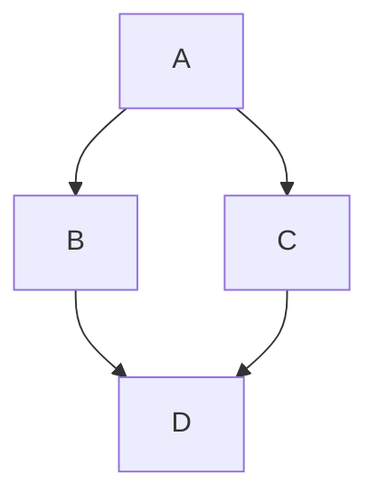

# A Sample Plan
This is a sample plan. It consists of three steps:

1. Do research on the topic (done)
2. Setup the models and APIs (not done)
3. Implement the feature (not done)

## Background Research 

## Implementation Details 
Write down the details of the implementation.

### Diagram 

## Steps

### Step 1: Do research on the topic
- [ ] Research the topic
- [ ] Write down the findings

### Step 2: Setup the models and APIs
- [ ] Setup the models and APIs
- [ ] Test the models and APIs

### Step 3: Implement the feature
- [ ] Implement the feature
- [ ] Test the feature
- [ ] Deploy the feature

