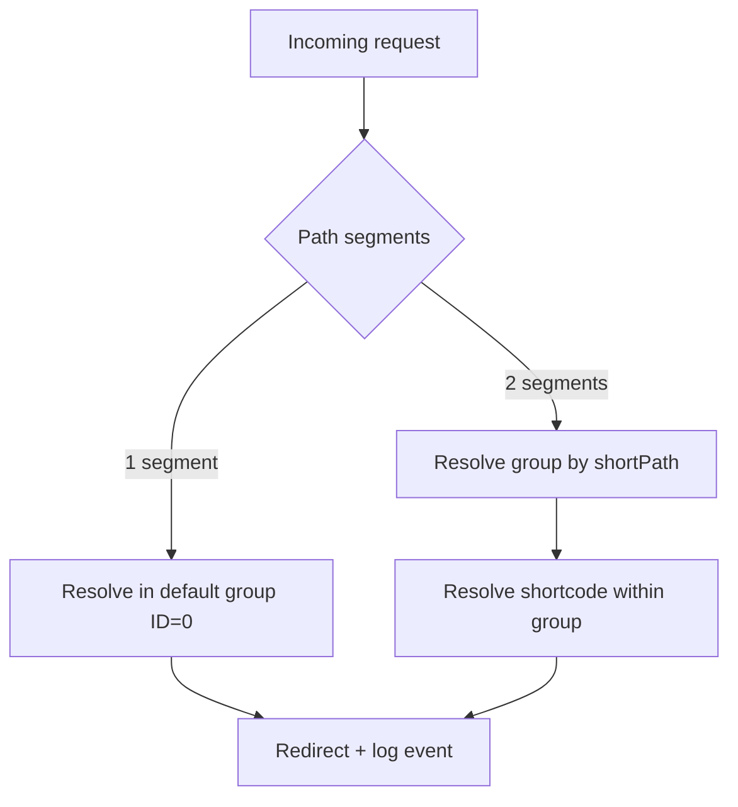

# 01 - URL Groups

Introduce first-class URL groups so URLs can exist both as:
- ungrouped: `1px.li/abcd`
- grouped: `1px.li/grp1/abcd`

The implementation should preserve current behavior for existing short URLs while adding group-scoped creation and redirect behavior with ownership checks.

## Background Research

### Current state in repository
- `src/controllers/urls.go` already includes:
  - `UrlGroupID` on URL creation (currently fixed to `0`)
  - `initDefaultUrlGroup()` with default group `ID=0`
  - scaffolded `CreateUrlGroup(...)` method
- `src/db/models/url_group.go` and `src/db/models/url.go` already represent group + URL entities, but constraints/routing behavior still need to be completed for grouped URLs.
- `src/routes/redirect/redirect.go` currently handles single-segment shortcodes; grouped path behavior needs to be added.

### Design intent to implement
- Groups behave like URL shortcodes in shape and constraints:
  - radix64-safe token
  - same allowed charset
  - same max-length policy
- Group ownership is enforced:
  - each group has a `CreatorID`
  - only the owner can create grouped URLs inside that group
- Group creation is admin-only and sets:
  - group ID / shortPath
  - owning creator/user

## Implementation Details

### Functional scope
1. Keep legacy links (`/abcd`) working via default group (`UrlGroupID=0`).
2. Add grouped links (`/grp/abcd`) with group ownership checks.
3. Make grouped + ungrouped shortcodes coexist safely.

### Data model and storage changes
- Update/confirm `UrlGroup` shape in `src/db/models/url_group.go`:
  - `ID` (primary key, numeric)
  - `ShortPath` (text token; mapped from radix64 representation of ID)
  - `CreatorID` (owner user ID)
- Update URL uniqueness in `src/db/models/url.go`:
  - existing global unique `short_url` will block duplicate shortcodes across groups
  - replace with composite uniqueness on (`url_group_id`, `short_url`)
- Preserve compatibility defaults:
  - existing URLs remain with `UrlGroupID=0`
  - default group (`ID=0`) must continue to exist

### Controller-level behavior
- Extend `src/controllers/urls.go` with explicit group-aware operations:
  - create group with explicit owner
  - fetch group by shortPath
  - create specific/random URL in a group
  - fetch URL by (`groupID`, `shortcode`)
- Keep existing ungrouped helper (`GetUrlWithShortCode`) backward compatible by resolving in default group.
- Replace recursive random-collision retry with bounded retries (or maintain recursion with TODO + cap), to avoid unbounded recursion risk.

### API and auth wiring
- In `src/routes/api/urls.go`:
  - add admin-only endpoint to create groups
  - add grouped URL creation endpoints (specific and random)
- Middleware:
  - admin group creation: `X-API-Key` guard
  - grouped URL creation: JWT user required + ownership check (`group.CreatorID == user.ID`)
- Errors should continue using `dtos.CreateErrorResponse` and existing error style.

### Redirect flow changes
- In `src/routes/redirect/redirect.go`, support both forms:
  - `/shortcode` -> resolve URL in default group
  - `/group/shortcode` -> resolve group by `group` token, then URL by shortcode scoped to that group
- Keep redirect event logging behavior unchanged in `src/controllers/events.go`, but ensure stored `short_url` representation for grouped redirects is consistent (recommend canonical `group/shortcode`).

### Validation rules
- Apply shortcode constraints equally to group shortPath:
  - allowed radix64 charset
  - max length identical to shortcode limit
  - non-empty token
- Implement shared validator helper in:
  - `src/server/validators/dto_url_validators.go`
- Reuse in both grouped route params and payload DTO validation.

### API contract proposal
- Admin creates group:
  - `POST /api/v1/urls/groups`
  - payload: `{ shortPath, creatorId }`
- User creates grouped URL:
  - `POST /api/v1/urls/groups/:group/shorten`
  - `POST /api/v1/urls/groups/:group/shorten/:shortcode`
- Existing ungrouped endpoints stay unchanged.

### Migration and compatibility strategy
- Ensure migration handles index transition safely across sqlite/postgres:
  - drop unique index on `short_url`
  - create composite unique index (`url_group_id`, `short_url`)
- Keep data migration minimal:
  - no rewrite of existing URL rows required
- Preserve startup bootstrap behavior:
  - default group creation via `initDefaultUrlGroup()`

### Test strategy

#### Unit tests
- `src/controllers/urls_test.go`
  - group creation success/failure
  - owner vs non-owner grouped URL creation
  - group-scoped lookup correctness
  - ungrouped lookup unaffected
- Validator tests in `src/server/validators/*`
  - valid/invalid group token cases

#### E2E tests
- `tests/e2e/*`
  - admin creates group
  - owner creates grouped URL (specific + random)
  - non-owner blocked with 403
  - grouped redirect returns expected redirect + event log behavior
  - existing `/shortcode` flow remains green

#### Regression checks
- run focused e2e for grouped routes first, then full suite:
  - `make test_e2e`
  - `make test_unit`
  - `make test`

## Risks and Mitigations
- Index migration mismatch between DB engines:
  - mitigate with explicit index names and startup logs.
- Route ambiguity between one-segment and two-segment redirects:
  - mitigate via deterministic route declaration order and explicit tests.
- Ownership bypass due to missing middleware check:
  - mitigate with dedicated unauthorized/forbidden e2e tests.
- Analytics key drift for grouped links:
  - mitigate by standardizing event `short_url` format.

## Diagram

## Steps

### Step 1: Align contracts and route shape
- [ ] Confirm final grouped API endpoints in `src/routes/api/urls.go`
- [ ] Confirm redirect path semantics in `src/routes/redirect/redirect.go`
- [ ] Freeze validation constraints for both group and shortcode tokens

### Step 2: Model + migration updates
- [ ] Update `src/db/models/url_group.go` for explicit shortPath semantics
- [ ] Update `src/db/models/url.go` uniqueness to group-scoped composite
- [ ] Implement/verify index migration behavior in `src/db/init.go`

### Step 3: Controller implementation
- [ ] Finish `CreateUrlGroup(...)` in `src/controllers/urls.go`
- [ ] Add group lookup + group-scoped URL create/get methods
- [ ] Keep backward-compatible default-group lookup path

### Step 4: API, auth, and validators
- [ ] Add admin-only group creation handler in `src/routes/api/urls.go`
- [ ] Add grouped URL creation handlers with owner check
- [ ] Add/extend DTOs and validators in `src/dtos/url_dtos.go` and `src/server/validators/dto_url_validators.go`

### Step 5: Redirect + analytics
- [ ] Implement grouped redirect resolver in `src/routes/redirect/redirect.go`
- [ ] Ensure consistent event logging shape in `src/controllers/events.go`
- [ ] Verify legacy redirect route still works unchanged

### Step 6: Tests + docs
- [ ] Add/expand unit tests in `src/controllers/urls_test.go`
- [ ] Add grouped e2e scenarios in `tests/e2e/*`
- [ ] Update Swagger annotations and regenerate docs only if endpoint annotations change
